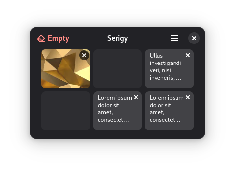

<h1 align="center">
  
  <br>
  Serigy
</h1>

<p align="center">Pin your clipboard</p>

<p align="center">
  </a>
</p>

Store important information from your clipboard selectively and securely, ensuring that only what you need is always within reach.

## Important

Serigy is not intended to be a clipboard manager, so please do not expect or demand features that involve constantly monitoring all clipboard information. The purpose of this application is to allow the user to pin the desired information while maintaining control over what they want to do."

## Build

#### We need the following resources:

- org.gnome.Sdk
- flatpak-builder

#### Clone, build and run:

Clone the latest Serigy source from GitHub

```bash
git clone https://github.com/CleoMenezesJr/Serigy.git
```

Enter the directory and build

```bash
cd Serigy
flatpak-builder build io.github.cleomenezesjr.Serigy.json --user --install --force-clean
```

Run

```bash
cd Serigy
flatpak run io.github.cleomenezesjr.Serigy
```

That's it!

## I want to create a pot file!

You can use this command to create a pot file for translation:

`xgettext --files-from=po/POTFILES --output=po/serigy.pot --from-code=UTF-8 --add-comments --keyword=_ --keyword=C_:1c,2`

<!-- ## I want to participate in the community! -->
<!-- Join [Aurea's room](https://matrix.to/#/%23aurea-app:matrix.org) at Matrix to ask questions and be part of the community. -->
